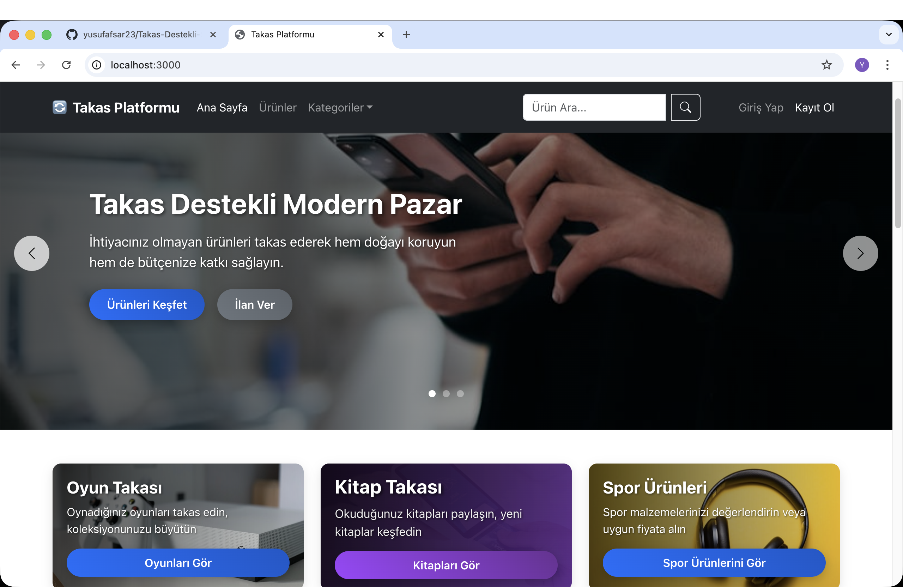
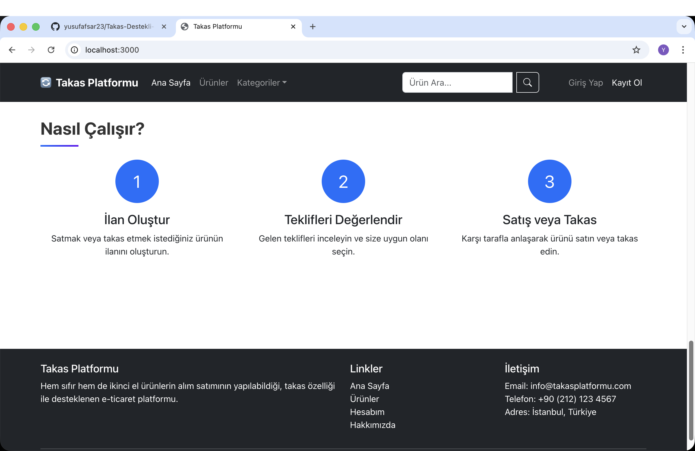
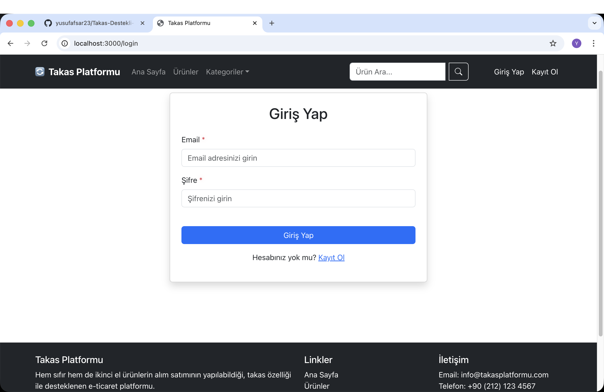
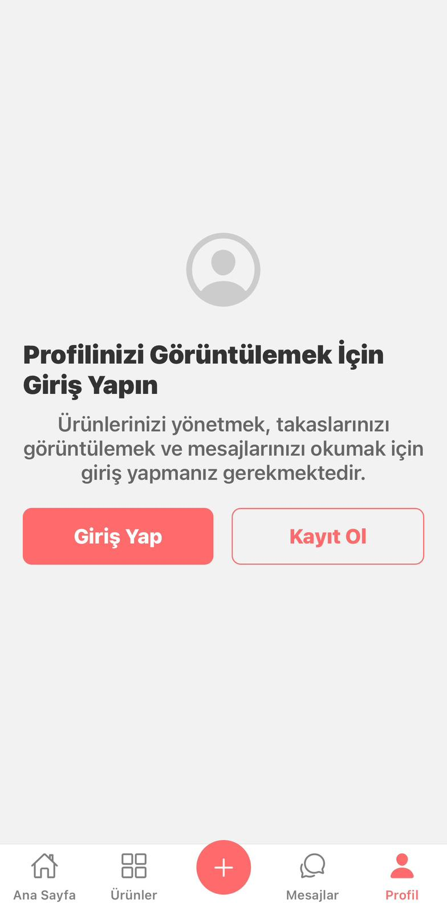
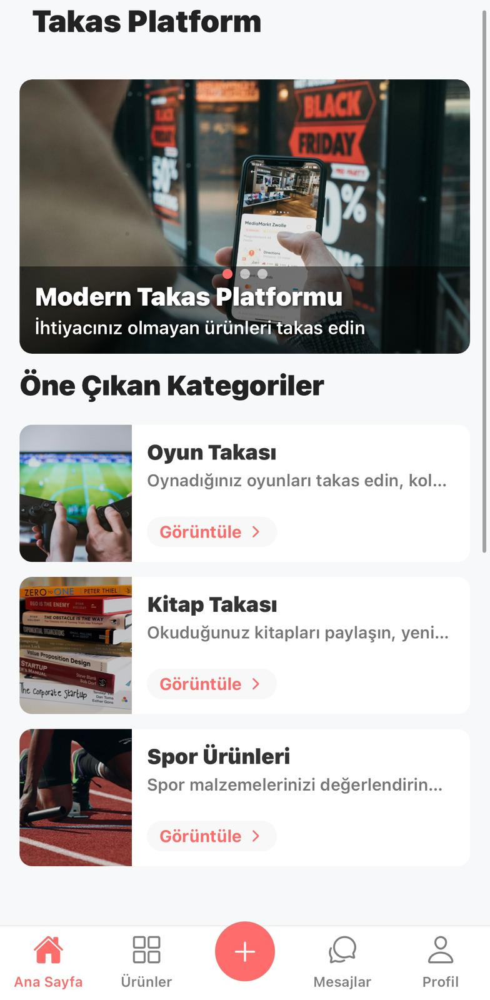
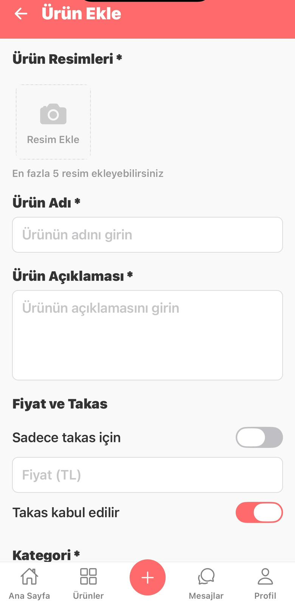

# Takas Destekli Satış Platformu

Hem sıfır hem de ikinci el ürünlerin alım satımının yapılabildiği, takas özelliği ile desteklenen e-ticaret platformu(WEB & MOBILE).

## Proje Tanımı

Bu proje, kullanıcıların ürünlerini satışa sunabileceği veya takas teklifleri alabileceği/gönderebileceği entegre çalışan web ve mobil platformdur. Satıcılar, takas tekliflerini kabul edebilir veya yalnızca belirli bir ürün türü ile takas yapmayı tercih edebilirler.

## Özellikler

- Kullanıcı kaydı ve giriş
- Ürün listeleme ve detaylı açıklama
- Takas teklifi gönderme/alma
- Kategori bazlı filtreleme ve arama
- Güvenli mesajlaşma
- Akıllı eşleştirme algoritmaları
- Web ve mobil uygulama desteği
- Gerçek zamanlı sohbet

## Teknolojiler

### Backend
- Node.js
- Express.js
- MongoDB
- Socket.io
- JWT Authentication

### Web Frontend
- React.js
- HTML5
- CSS3
- JavaScript

### Mobil Uygulama
- React Native
- Expo

## Kurulum

### Backend
```bash
cd backend
npm install
npm run dev
```

### Web Frontend
```bash
cd frontend
npm install
npm start
```

### Mobil Uygulama
```bash
cd mobile
npm install
npm start
```
## Bazı Görüntüler




<p>
  
  
  
</p>


## Geliştirme Süreci

Bu proje 12 haftalık bir süreçte geliştirilmektedir. İlerleme durumu için [ROADMAP.md](ROADMAP.md) dosyasına bakabilirsiniz.

## Lisans

ISC 